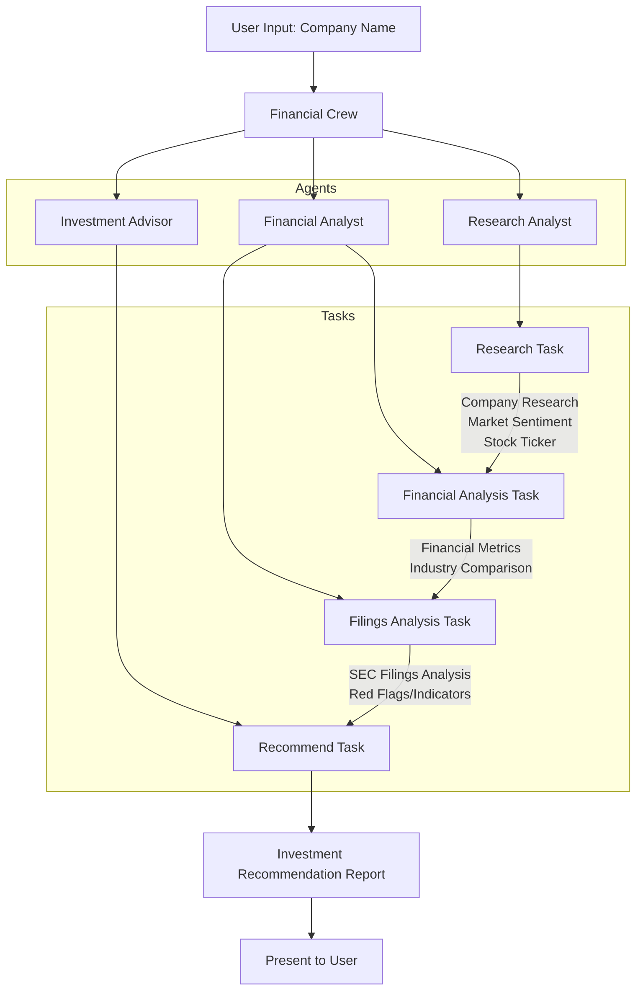
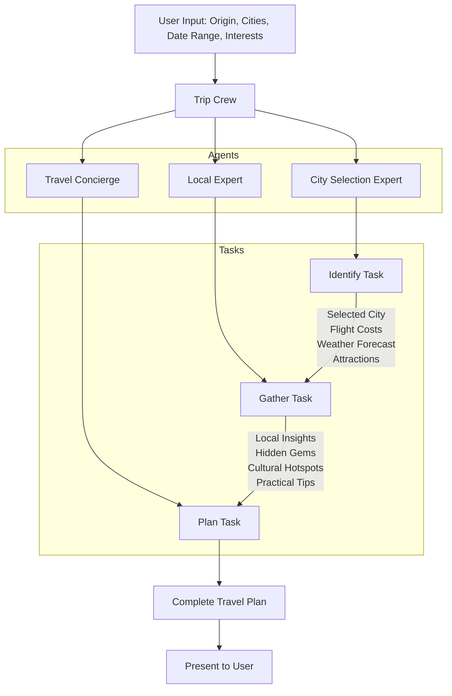
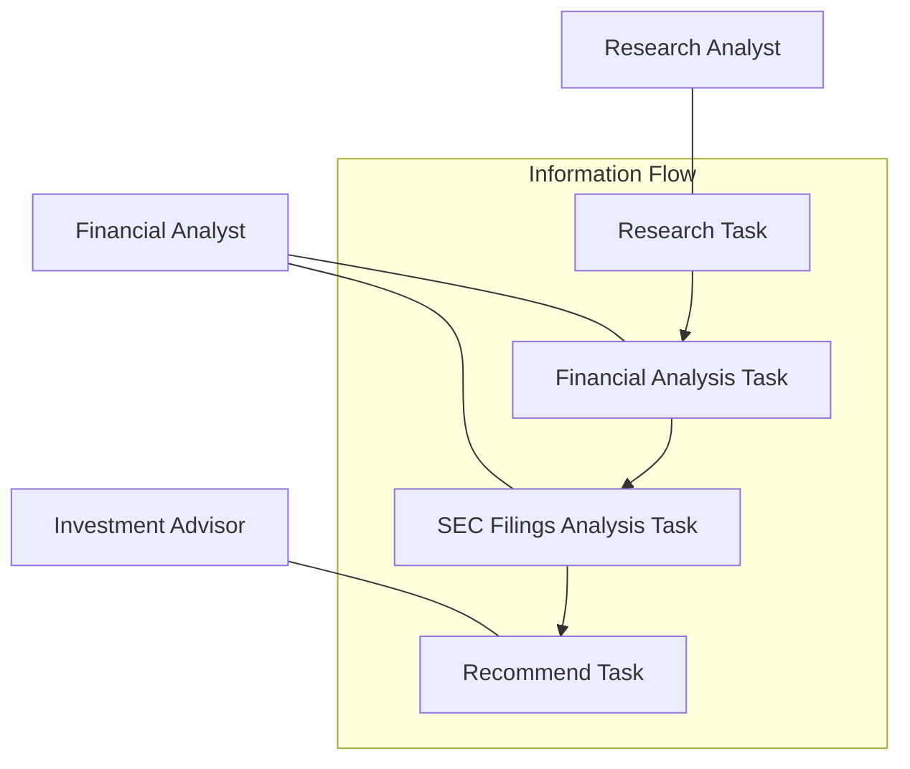
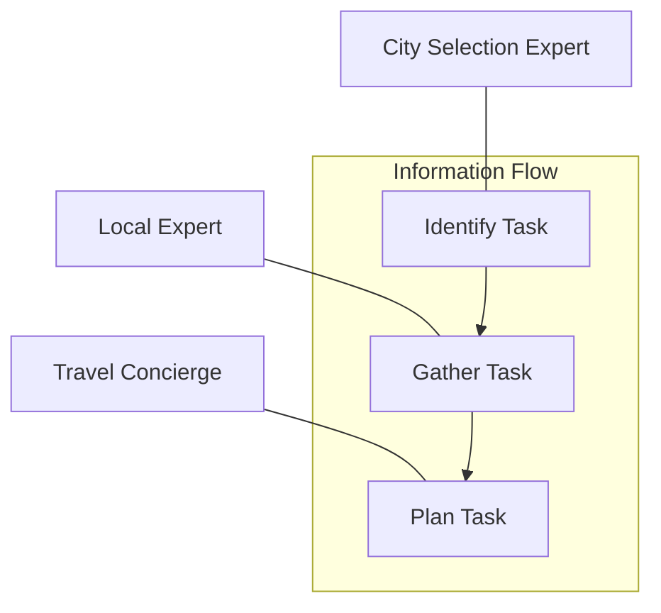
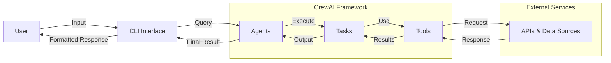

# CrewAI Applications: Agent Flow Diagrams

This document visualizes the agent workflows for the CrewAI applications using Mermaid diagrams.

## Stock Analysis Flow

## Trip Planner Flow

## Agent-Task Relationships

### Stock Analysis Agent-Task Matrix

### Trip Planner Agent-Task Matrix

## Data Flow Architecture

